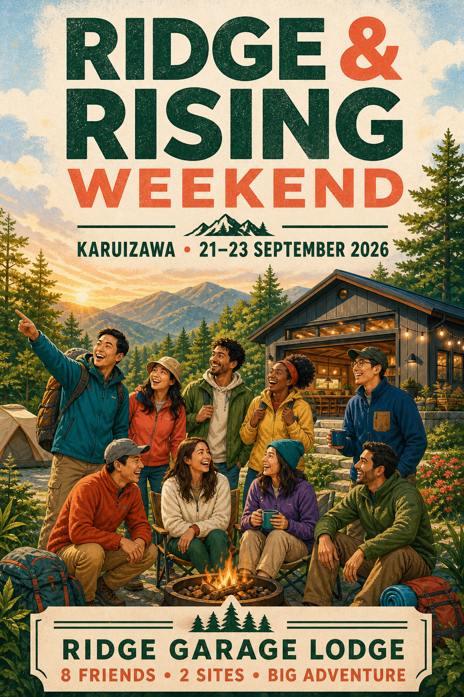

# Seruput Entertainment goes to Karuizawa

*21–23 September 2026 · Karuizawa · Ridge Garage Lodge · 2 sites*

> **Quick summary:** Eight Indonesian participants will stay two nights at Ridge Garage Lodge, with the trip centered on Rising Field, its facilities, and nearby nature. We will use a highway bus Tokyo ↔ Karuizawa and a local bus to and from the Rising Field area. **Estimated total for eight: ¥240,160–¥268,160 (¥30,020–¥33,520 per person).**

## Please review

Please comment on these points before booking:

1. Can you attend all three days, 21–23 September 2026?
2. Does the quoted ¥132,000 cover both sites for both nights?
3. Are the bus route, Day 2 waterfall loop, shared cooking, and rainy-day plan practical?
4. Do you have any food, accessibility, sleeping, or schedule requirements?

## Fixed plan

| Item | Plan |
|---|---|
| Dates | Monday 21–Wednesday 23 September 2026 |
| Stay | Ridge Garage Lodge · 2 sites · 2 nights |
| Group | 8 Indonesian participants · 4 men / 4 women |
| Route | Tokyo → Karuizawa → Rising Field / Ridge Garage Lodge → Karuizawa → Tokyo |
| Transport | Highway bus Tokyo ↔ Karuizawa; local bus Karuizawa Station ↔ Rising Field |
| Focus | Rising Field facilities, nearby nature, shared meals, and group time |
| Food | Muslim-friendly planning; verify ingredients and avoid alcohol venues |

## Destination map links

These are the destination pins used in the schedule. The Ridge Garage Lodge reservation is treated as being inside the Rising Field campus; confirm the exact lodge plot from the booking.

| Destination | Google Maps |
|---|---|
| Shibuya Mark City highway-bus terminal | [Open map](https://www.google.com/maps?q=Shibuya+Mark+City+Highway+Bus+Terminal) |
| Karuizawa Station | [Open map](https://maps.app.goo.gl/qYpCkzKeKFZDJB5J9) |
| Rising Field Karuizawa | [Open map](https://www.google.com/maps?q=Rising+Field+Karuizawa,+2129+Nagakurayama+National+Forest,+Karuizawa,+Nagano) |
| Ridge Garage Lodge / Rising Field campus | [Open campus map](https://www.google.com/maps?q=Rising+Field+Karuizawa,+2129+Nagakurayama+National+Forest,+Karuizawa,+Nagano) |
| Kose Onsen bus stop | [Open map](https://www.google.com/maps?q=Kose+Onsen,+Karuizawa,+Nagano) |
| Ryugaeshi Falls | [Open map](https://maps.app.goo.gl/A2VKvaoHRbUvRbEP8) |
| Shiraito Waterfall | [Open map](https://maps.app.goo.gl/MkpkNZkBbcNieEQ56) |

Rising Field’s official access page gives the campus address and confirms the public-bus connection from Karuizawa Station. [Official access page](https://www.rising-field.com/rfk-access)

## Reservation and stay

| Item | Supplied details |
|---|---|
| Accommodation | Ridge Garage Lodge |
| Sites | 2 |
| Check-in / checkout | 21 September / 23 September 2026 |
| Capacity | 8 per site; 16 total stated capacity |
| Pet policy | Pets allowed, subject to lodge conditions |
| Quoted fee | ¥66,000 on 21 September + ¥66,000 on 22 September |
| Working total | **¥132,000** for both nights |

The ¥132,000 figure is provisional. Confirm that it covers both sites before payment, plus the actual beds or futons, heating, bathrooms, kitchen, showers, power, cooking rules, fire rules, quiet hours, and rubbish process.

*Stay visuals: user-supplied Ridge Garage Lodge images. Confirm which image matches the reserved unit and which facilities are included.*

## Group and site setup

| Participant | Group | Starting area |
|---|---|---|
| Ismail | Man | Kawaguchi, Saitama |
| Bayu | Man | Itabashi |
| Azis | Man | Kawaguchi, Saitama |
| Dhanang/Darto | Man | Chiba |
| Mila | Woman | Yokohama |
| Ghisa | Woman | Yokohama |
| Elis | Woman | Yokohama |
| Vany | Woman | Tokyo |

- **Site 1:** four men. **Site 2:** four women. Confirm privacy and sleeping arrangements with the lodge.
- Ismail and Azis can coordinate from Kawaguchi; Mila, Ghisa, and Elis from Yokohama. Bayu, Vany, and Dhanang/Darto join the agreed Tokyo departure from their own areas.
- Meet at [Shibuya Mark City](https://www.google.com/maps?q=Shibuya+Mark+City+Highway+Bus+Terminal) at least 30 minutes before the booked departure. Confirm attendance before booking all eight bus seats.

## Timed itinerary

Each day has one core time plan with a sunny option and a rain option. Times marked “target” must be replaced with the booked departure or the lodge’s confirmed check-in/check-out time.

### Monday 21 September · Tokyo → Ridge Garage Lodge

*Highlight image: Karuizawa Station arrival. [Image source: Karuizawa Tourism Association](https://karuizawa-kankokyokai.jp/course/63848/).*

| Time | Sunny plan | Rain plan |
|---|---|---|
| 06:40–07:00 | Meet at [Shibuya Mark City](https://www.google.com/maps?q=Shibuya+Mark+City+Highway+Bus+Terminal), attendance check, and board preparation. | Wait inside the bus terminal; confirm tickets, luggage, and rain gear. |
| 07:20–09:20 | Take the first suitable booked highway bus to [Karuizawa Station](https://maps.app.goo.gl/qYpCkzKeKFZDJB5J9). Current reference journey is about 3 hours; record the final booked time here. | Same transport plan; keep all luggage covered and allow for traffic. |
| 10:35–12:35 | Arrive at Karuizawa Station, buy lunch and simple groceries, and use facilities. | Stay inside the station, eat lunch, and avoid adding outdoor stops. |
| 11:10–12:55 | Take the first practical local bus to [Rising Field](https://www.google.com/maps?q=Rising+Field+Karuizawa,+2129+Nagakurayama+National+Forest,+Karuizawa,+Nagano); use the later connection if the highway bus arrives later. | Take the same local bus connection; do not walk long distances with luggage. |
| 13:00–14:00 | Lunch, luggage drop if permitted, and check the two-site layout. | Lunch and luggage organization inside the permitted lodge/common area. |
| 14:00–15:00 | Orientation around the campus, facilities, bathrooms, water, charging, waste, and emergency contacts. | Indoor facility orientation and lodge rules review. |
| 15:00–17:30 | Check in at the lodge’s confirmed time, settle rooms, take a short established-path walk, and rest. | Check in, dry gear, rest, and use only confirmed indoor facilities. |
| 17:30–21:00 | Cook dinner, prayer, games, and quiet conversation. Stargazing only if weather and quiet hours allow. | Shared cooking, prayer, games, and quiet indoor gathering; no campfire. |

The highway-bus route and fare must be confirmed on the [official Tokyo/Shibuya–Karuizawa booking page](https://www.highwaybus.com/gp/inbound/inbRouteList?arefNameCd=110&rrefNameCd=113). The local-bus reference timetable lists Rising Field services from Karuizawa Station through the day. [Current Kusakaru timetable](https://www.kkkg.co.jp/bus/timetable/en-timetable.pdf?v=202604)

### Tuesday 22 September · Waterfalls and Rising Field

*Highlight image: Karuizawa waterfall. [Image source: Le Grand Karuizawa photo gallery](https://www.legrand-karuizawa.jp/photo/img/170613/main_sp_img_001.jpg).*

Ryugaeshi Falls is accessed from Kose Onsen with approximately a 15-minute walk. The local bus timetable also lists Kose Onsen, Shiraito Waterfall, and Rising Field stops. [Access reference](https://en.slow-style.com/spots/ryugaeshi-fall/), [current Kusakaru timetable](https://www.kkkg.co.jp/bus/timetable/en-timetable.pdf?v=202604)

| Time | Sunny plan | Rain plan |
|---|---|---|
| 07:30–08:15 | Breakfast, hydration, weather check, and pack a light day bag. | Breakfast, weather check, and confirm the lodge-first plan. |
| 08:15–08:45 | Walk to the [Rising Field](https://www.google.com/maps?q=Rising+Field+Karuizawa,+2129+Nagakurayama+National+Forest,+Karuizawa,+Nagano) bus stop; bring water and rain layers. | Indoor warm-up, prayer, and prepare games/cooking materials. |
| 08:55–09:10 | Local bus to [Kose Onsen](https://www.google.com/maps?q=Kose+Onsen,+Karuizawa,+Nagano); use the next safe service if delayed. | Stay at the lodge; no waterfall transfer in unsafe rain. |
| 09:10–10:15 | Walk approximately 15 minutes to [Ryugaeshi Falls](https://maps.app.goo.gl/A2VKvaoHRbUvRbEP8), enjoy the forest path, take photos, and return to Kose Onsen. | Facility time: common area, journaling, cards, and group planning. |
| 10:36–10:45 | Local bus from Kose Onsen to [Shiraito Waterfall](https://maps.app.goo.gl/MkpkNZkBbcNieEQ56). | Indoor group program and warm drinks. |
| 10:45–11:40 | Visit Shiraito Waterfall; stay on marked paths and keep the group together. | Continue lodge activity; optional short covered movement only if safe. |
| 11:46–12:00 | Return by local bus to Rising Field, then walk back to the lodge. | Prepare lunch at the lodge. |
| 12:00–13:30 | Lunch, prayer, hydration, and rest. | Lunch, prayer, hydration, and rest. |
| 13:30–15:30 | Use lodge/common/outdoor facilities for photos, light games, and a shared reflection. | Lodge-first: shared cooking prep, board/card games, sketching, journaling, and rest. |
| 15:30–17:00 | Optional 8–12 km run or short campus activity; non-runners use the facilities. | Indoor facility time and flexible personal rest. |
| 17:00–21:00 | Cook dinner, clean both sites, prayer, non-alcoholic drinks, games, and conversation. Campfire only with lodge permission. | Cook dinner, clean both sites, prayer, games, and quiet indoor gathering. |

### Wednesday 23 September · Light morning → Tokyo

*Highlight image: a relaxed final morning at the lodge. Image supplied for Ridge Garage Lodge; confirm the exact reserved-unit view.*

The Wednesday plan deliberately leaves in the afternoon. The working return target is the **16:30 highway bus** from Karuizawa Station, expected to reach Shibuya around **19:35**; the **17:30 service** is the latest planned backup, expected around **20:35**. Do not use the 18:30 service as the normal plan because traffic could push arrival beyond the group’s limit.

| Time | Sunny plan | Rain plan |
|---|---|---|
| 07:30–08:15 | Breakfast and final weather check. | Breakfast and confirm the early indoor plan. |
| 08:15–10:00 | Light campus walk, photos, and one final use of the outdoor facilities. | Lodge facilities, tea, games, journaling, or quiet rest. |
| 10:00–11:30 | Pack, separate rubbish, clean both sites, check lost property, and return equipment. | Same checkout tasks indoors; dry and consolidate rain gear. |
| 11:30–12:30 | Early lunch and final lodge questions. | Early lunch and final lodge questions. |
| 12:30–13:15 | Confirm checkout at the lodge’s required time and walk to the bus stop. | Confirm checkout and move carefully with covered luggage. |
| 13:48–14:05 | Target local bus from [Rising Field](https://www.google.com/maps?q=Rising+Field+Karuizawa,+2129+Nagakurayama+National+Forest,+Karuizawa,+Nagano) to [Karuizawa Station](https://maps.app.goo.gl/qYpCkzKeKFZDJB5J9). | Same transfer; leave no later than the target connection. |
| 14:05–16:00 | Station lunch, toilets, lockers, souvenirs, and a large boarding buffer. | Stay inside the station and keep luggage dry. |
| 16:00–16:30 | Board the target highway bus from [Karuizawa Station](https://maps.app.goo.gl/qYpCkzKeKFZDJB5J9) to [Shibuya Mark City](https://www.google.com/maps?q=Shibuya+Mark+City+Highway+Bus+Terminal). | Same target bus; no extra sightseeing. |
| 16:30–19:35 | Target arrival in Shibuya around 19:35, subject to traffic. | Same target arrival; allow for weather-related delay. |
| 17:30–20:35 | If the 16:30 service is unavailable, use the booked 17:30 backup and aim for Shibuya around 20:35. | Same backup rule; do not add stops. |

Confirm the dated 23 September service and seats using the [official highway-bus booking page](https://www.highwaybus.com/gp/inbound/inbRouteList?arefNameCd=110&rrefNameCd=113). The operator notes that traffic can change arrival times. [Official route details](https://www.highwaybus.com/gp/info/lineDetail?lineGroupNo=75&lineId=300)

## Budget for eight people

The working model assumes ¥132,000 is the total for both sites and both nights. Recheck accommodation, bus fares, availability, and facility charges before payment.

| Category | Per person | Group total |
|---|---:|---:|
| Ridge Garage Lodge | ¥16,500 | ¥132,000 |
| Highway bus return | ¥6,600 | ¥52,800 |
| Rising Field local buses | ¥920 | ¥7,360 |
| Tokyo rail to/from bus terminal | ¥1,000 allowance | ¥8,000 |
| Food and groceries | ¥4,500–¥6,000 | ¥36,000–¥48,000 |
| Activities | ¥0–¥1,500 | ¥0–¥12,000 |
| Locker / contingency | ¥500–¥1,000 | ¥4,000–¥8,000 |
| **Estimated total** | **¥30,020–¥33,520** | **¥240,160–¥268,160** |

If fewer than eight people join, the accommodation share increases. Six people would pay approximately **¥35,520–¥39,020 per person** under the same assumptions.

## Food and practical requirements

Everyone should confirm food requirements before grocery shopping. Japanese food can contain pork stock, lard, mirin, cooking sake, alcohol, gelatin, dashi, or other non-halal ingredients.

`ムスリムです。豚肉、ラード、酒、みりんを使わない料理をお願いします。`

Plan around clearly labelled groceries, vegetables, fruit, tofu, seafood, and halal pantry basics from Tokyo. Confirm lodge cookware, grills, and shared utensils before cooking.

## Final decisions and preparation

1. Confirm attendance for all eight participants.
2. Confirm that the Ridge Garage Lodge quote covers two sites for both nights, plus the sleeping layout and included facilities.
3. Confirm cooking, fire, noise, rubbish, pet, and outdoor-activity rules.
4. Book the exact outbound highway-bus service and all confirmed return seats.
5. Confirm the local-bus connections for the Day 2 waterfall loop and Wednesday’s 13:48 target.
6. Prepare the shared grocery list, prayer/rest timing, warm layers, rain gear, headlamps, chargers, and first-aid kit.
7. Check the weather shortly before departure and use the Rain column when needed.

## Sources

- [Rising Field camping](https://www.rising-field.com/rfk-camp)
- [Rising Field access](https://www.rising-field.com/rfk-access)
- [Rising Field facilities and prices](https://www.rising-field.com/rfk-facility-schedule)
- [Kusakaru 2026 timetable](https://www.kkkg.co.jp/bus/timetable/en-timetable.pdf?v=202604)
- [Highwaybus.com Tokyo/Shibuya–Karuizawa booking](https://www.highwaybus.com/gp/inbound/inbRouteList?arefNameCd=110&rrefNameCd=113)
- [Highway-bus route details](https://www.highwaybus.com/gp/info/lineDetail?lineGroupNo=75&lineId=300)
- [Ryugaeshi Falls access](https://en.slow-style.com/spots/ryugaeshi-fall/)
